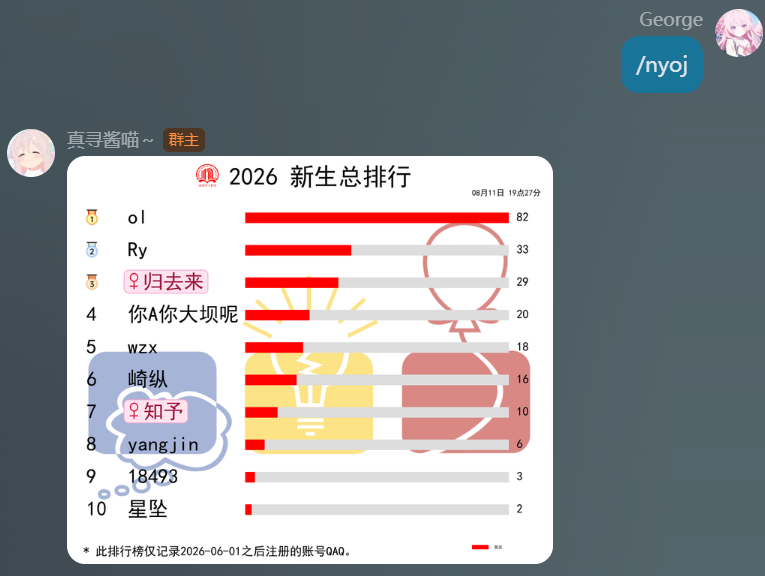
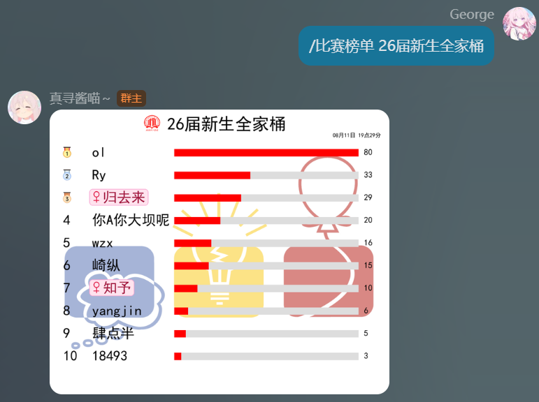
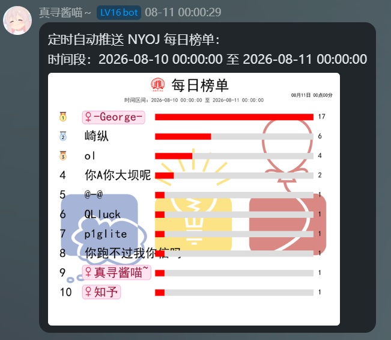
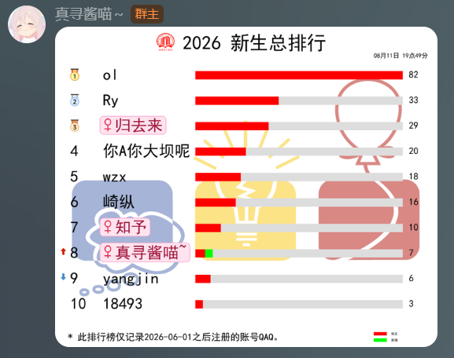
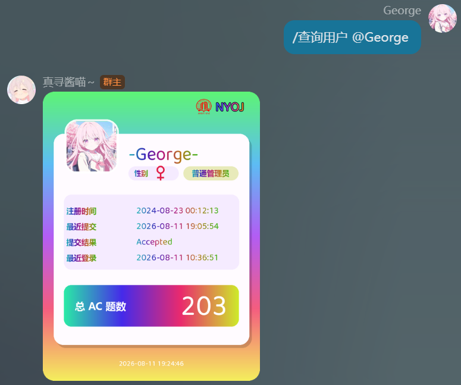
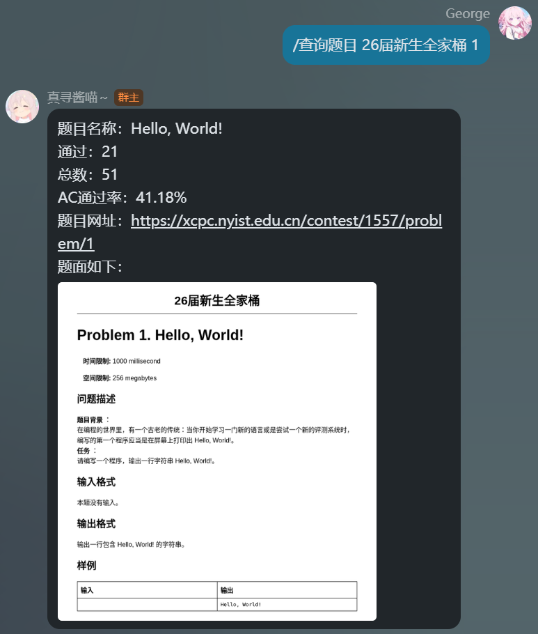

# 🏆 NYOJ

<p align="center">
  
</p>


<p align="center" style="margin-top: 8px; font-size: 18px;">
  ✨ <a href="https://github.com/AstrBotDevs/AstrBot" target="_blank">AstrBot</a> NYOJ 排行榜同步、过题通知与榜单推送插件 ✨
</p>


<p align="center">
  <a href="https://opensource.org/licenses/MIT"></a>
  
  
  <a href="https://github.com/GGGeeeooorrrgggeee/astrbot_plugin_nyoj"></a>
  <a href="https://github.com/GGGeeeooorrrgggeee/astrbot_plugin_nyoj/commits/main"></a>
</p>


<p align="center">
  <strong>Language / 语言</strong><br>
  <a href="README.md"></a>
</p>


---

## 一、简介 📖

NYOJ 是南阳理工学院计科 ACM&&TC 集训队所属的 OJ 名称。本项目是一个面向 NYOJ 的 [AstrBot](https://github.com/AstrBotDevs/AstrBot) 插件，支持从 NYOJ 数据库同步用户与 AC 数据，生成总排行榜、比赛榜单、每日榜单、过题通知图片、排行榜升降图，并提供题目查询和用户主页卡片功能。

本项目整合自前几届学长留下的 NoneBot 插件代码。原项目没有完整版本管理记录，因此这里在保留核心思路的基础上，将其适配到 AstrBot，并继续新增了一些功能。

插件会使用本地 SQLite 缓存同步数据，定时任务、榜单人数、黑名单、推送目标等都可以在 AstrBot 插件配置中管理。

## 二、项目信息 ℹ️

- 作者：[George](https://github.com/GGGeeeooorrrgggeee)
- 版本：1.0.0
- 插件名：`astrbot_plugin_nyoj`
- 仓库：[astrbot_plugin_nyoj](https://github.com/GGGeeeooorrrgggeee/astrbot_plugin_nyoj)
- 支持平台：`aiocqhttp`

## 三、核心功能 ✅

| 功能         | 说明                                                         |
| :----------- | :----------------------------------------------------------- |
| 用户数据同步 | 从 NYOJ MySQL 数据库同步用户基础信息、注册时间、性别等数据；定时任务每 1 小时执行一次 |
| AC 数据同步  | 增量同步用户 AC 题目数据，并维护本地 AC 统计；定时任务每 1 分钟执行一次 |
| 总排行榜     | 通过 `nyoj` 指令生成新生总排行图片                           |
| 比赛榜单     | 按比赛名称查询并生成比赛排行榜图片                           |
| 每日榜单     | 查询指定时间段内的 AC 排行榜，支持定时推送                   |
| 过题通知     | 用户新增 AC 数达到阈值时生成通知图片并推送                   |
| 排行榜升降   | AC 同步后检测榜单变化，自动推送变化后的排行榜图片            |
| 题目查询     | 按比赛名称和题号查询题目，通过 Chromium 生成题面图片         |
| 用户查询     | 按用户名、QQ 邮箱、艾特对象或“自己”生成用户主页卡片，图片样式魔改自 [ACMBot](https://github.com/suzmii/ACMBot) |
| 女生标识     | 榜单中的女性用户会使用粉色圆角背景突出显示，用户名前会带有 `♀` 女性符号 |
| 黑名单       | 所有榜单都会过滤配置中的黑名单用户名                         |

## 四、文件结构 📂

```text
astrbot_plugin_nyoj/
├── main.py              # 插件入口与指令处理
├── config.py            # 配置解析
├── runtime.py           # 同步、查询、渲染业务流程
├── repository.py        # 本地 SQLite 读写
├── mysql_client.py      # NYOJ MySQL 数据读取
├── ranking_service.py   # 排行榜构建与升降对比
├── contest_client.py    # 比赛榜单接口查询
├── problem_client.py    # 题目查询与 HTML 转图片
├── renderer.py          # 排行榜和过题通知图片生成
├── profile_card.py      # 用户主页卡片生成
├── scheduler.py         # 定时任务调度
├── models.py            # 数据模型
├── paths.py             # 插件路径管理
├── assets/
│   ├── fonts/           # 字体文件
│   │   ├── msyhbd.ttc
│   │   ├── simhei.ttf
│   │   └── zsft184.ttf
│   └── images/          # 默认图片素材
│       ├── AC.jpg
│       ├── ACM.jpg
│       ├── NYIST.png
│       ├── 上升.png
│       ├── 下降.png
│       ├── 金牌.png
│       ├── 银牌.png
│       └── 铜牌.png
├── example_images/      # README 示例图
│   ├── rank_demo.png
│   ├── contest_rank_demo.png
│   ├── daily_rank_demo.png
│   ├── rank_change_demo.png
│   ├── user_profile_demo.png
│   ├── problem_demo.png
│   └── notify_demo.png
├── _conf_schema.json    # AstrBot 插件配置项
├── metadata.yaml        # 插件元数据
├── requirements.txt     # Python 依赖
├── README.md            # 项目说明文档
├── LICENSE              # 开源协议
└── logo.png             # 插件图标
```

## 五、依赖 📦

```text
aiomysql
aiosqlite
apscheduler
Pillow
aiohttp
pycryptodome
```


## 六、安装 🚀

1. 将插件放入 AstrBot 的插件目录，或通过 AstrBot 插件管理安装。
2. AstrBot 通常会自动安装 `requirements.txt` 中的依赖；如果依赖安装失败，请根据日志手动安装。
3. 如果需要使用 `查询题目`，请在服务器中安装 Chromium，并确保插件能够找到 Chromium 可执行文件。
4. 在 AstrBot WebUI 中填写插件配置。
5. 重载或重启 AstrBot。
6. 首次使用前执行：

```text
nyoj初始化
```

初始化会同步用户数据和 AC 数据，并把当前 AC 数作为过题通知基线，避免历史 AC 被当成新通知推送。

初始化完成后，请在 AstrBot 插件配置中开启：

- `启用用户定时同步`
- `启用AC定时同步`

## 七、配置说明 ⚙️

### 基础配置

| 配置项 | 说明                                  |
| :----- | :------------------------------------ |
| OJ名称 | 默认 `NYOJ`，用于消息、日志和图片显示 |

### MySQL 数据库配置

| 配置项         | 说明            |
| :------------- | :-------------- |
| MySQL 主机地址 | NYOJ 数据库地址 |
| MySQL 端口     | 默认 `3306`     |
| MySQL 用户名   | 数据库用户名    |
| MySQL 密码     | 数据库密码      |
| MySQL 数据库名 | NYOJ 数据库名   |

### NYOJ 接口配置

| 配置项               | 说明                                           |
| :------------------- | :--------------------------------------------- |
| NYOJ 网站地址        | 用于比赛榜单和题目查询                         |
| NYOJ 登录账号        | 调用接口时使用的登录账号                       |
| NYOJ 登录密码        | 调用接口时使用的登录密码                       |
| NYOJ 接口 secret_key | 用于部分接口参数加密                           |
| 允许查询非公开赛     | 同时控制“比赛榜单”和“查询题目”能否查询非公开赛 |

### 排行榜配置

| 配置项               | 说明                                           |
| :------------------- | :--------------------------------------------- |
| 榜单标题             | `nyoj` 总榜图片标题                            |
| 榜单起始注册日期     | 只统计该日期之后注册的账号                     |
| 榜单基础人数         | 默认显示人数；末尾 AC 数相同会继续保留并列用户 |
| 手动查询榜单最大人数 | 限制普通查询一次生成过大的榜单                 |
| 榜单用户黑名单       | 所有榜单都会过滤这些用户名                     |

### 推送配置

| 配置项             | 说明                                         |
| :----------------- | :------------------------------------------- |
| 推送平台ID         | AstrBot 平台实例 ID，默认 `OJbot`            |
| 推送消息类型       | 默认 `GroupMessage`                          |
| 推送目标QQ群号列表 | 定时任务、过题通知、榜单变化等会推送到这些群 |

### 定时任务配置

| 配置项           | 说明                                   |
| :--------------- | :------------------------------------- |
| 启用用户定时同步 | 是否每 1 小时按配置时间同步用户数据    |
| 用户同步时间     | 格式 `MM:SS`，表示每小时的第几分第几秒 |
| 启用AC定时同步   | 是否每 1 分钟按配置时间同步 AC 数据    |
| AC同步时间       | 格式 `SS`，表示每分钟的第几秒          |

### 每日榜单配置

| 配置项               | 说明                                       |
| :------------------- | :----------------------------------------- |
| 启用每日榜单定时推送 | 是否每天自动推送每日榜单                   |
| 每日榜单发送时间     | 统计结束日发送榜单的时间                   |
| 每日榜单统计开始时间 | 统计区间第一天的开始时间                   |
| 每日榜单统计结束时间 | 统计区间第二天的结束时间                   |
| 每日榜单查询超时时间 | 默认 40 秒，查询超过该秒数会停止并返回错误 |

建议每日榜单发送时间和统计结束时间保持一致，例如都为 `00:00:00`。

### 过题通知配置

| 配置项       | 说明                                                   |
| :----------- | :----------------------------------------------------- |
| 启用过题通知 | 关闭后仍会同步 AC 并更新通知基线，但不发送过题通知图片 |
| 过题通知阈值 | 相对上一次通知时记录的 AC 数，新增达到该值后触发       |

## 八、指令说明 🧾

插件指令会跟随 AstrBot 设置的命令前缀。例如 AstrBot 前缀是 `/`，则使用 `/nyoj`；如果前缀是 `#`，则使用 `#nyoj`。

### 普通指令

| 指令         | 参数                          | 说明                                                         |
| :----------- | :---------------------------- | :----------------------------------------------------------- |
| `nyoj`       | 日期(可选)、人数(可选)        | 查询总排行榜                                                 |
| `比赛榜单`   | 比赛名、人数(可选)            | 查询某场比赛榜单                                             |
| `每日榜单`   | 无                            | 手动查询当前所在统计区间的每日榜单，只返回榜单图片           |
| `查询题目`   | 比赛名 题号                   | 查询比赛题目，并通过服务器 Chromium 将题面 HTML 渲染成图片返回 |
| `查询用户`   | 用户名 / @某人 / @QQ号 / 自己 | 查询用户主页卡片                                             |
| `查询黑名单` | 无                            | 查看当前榜单黑名单                                           |

示例：

```text
nyoj
nyoj 2026-06-01 20
比赛榜单 26届新生全家桶 10
每日榜单
查询题目 26届新生全家桶 4
查询用户 自己
查询用户 @某人
查询黑名单
```

### 管理员指令

| 指令               | 参数   | 说明                                         |
| :----------------- | :----- | :------------------------------------------- |
| `nyoj初始化`       | 无     | 同步用户和 AC 数据，建立通知基线             |
| `同步用户`         | 无     | 手动同步用户信息                             |
| `同步AC`           | 无     | 手动同步 AC 增量，并检测通知和榜单变化       |
| `db状态`           | 无     | 查看本地 SQLite 数据状态                     |
| `定时状态`         | 无     | 查看定时任务配置、下次运行时间和最近执行状态 |
| `推送目标`         | 无     | 查看当前推送目标                             |
| `测试推送`         | 无     | 向配置的群发送测试消息                       |
| `开启查询非公开赛` | 无     | 开启非公开赛查询                             |
| `关闭查询非公开赛` | 无     | 关闭非公开赛查询                             |
| `开启过题通知`     | 无     | 开启过题通知                                 |
| `关闭过题通知`     | 无     | 关闭过题通知                                 |
| `更改榜单基础人数` | 数字   | 修改榜单基础人数并刷新缓存                   |
| `更改榜单最大人数` | 数字   | 修改手动查询榜单最大人数                     |
| `添加黑名单`       | 用户名 | 添加榜单黑名单并刷新缓存                     |
| `删除黑名单`       | 用户名 | 删除榜单黑名单并刷新缓存                     |

## 九、排名规则 📊

- 总榜、缓存榜、AC 同步后的榜单变化：先按 AC 数降序，AC 相同时按数据库当前排序规则下的用户名升序。
- 比赛榜单：保持 NYOJ 接口返回顺序，过滤黑名单后重新编号。
- 每日榜单：先按时间段内 AC 数降序，AC 相同时按数据库当前排序规则下的用户名升序。
- 榜单达到基础人数后，如果末尾 AC 数相同，会继续保留并列用户。
- 榜单图片会根据本地同步到的性别信息，为女性用户显示粉色圆角背景，并在用户名前显示 `♀` 女性符号。
- 黑名单会在生成榜单前过滤，被过滤后后面的用户会往前补。

## 十、用户主页背景档位 🎨

`查询用户` 生成的个人主页卡片会根据用户总 AC 题数切换背景主题，这部分样式同样魔改自 [ACMBot](https://github.com/suzmii/ACMBot)：

| 总 AC 题数  | 背景主题 | 背景渐变色                 |
| :---------- | :------- | :------------------------- |
| `< 25`      | 灰色     | `#9CA3AF` → `#6B7280`      |
| `25 - 49`   | 黄绿色   | `#A3E635` → `#65A30D`      |
| `50 - 74`   | 青色     | `#22D3EE` → `#0891B2`      |
| `75 - 99`   | 蓝色     | `#38BDF8` → `#2563EB`      |
| `100 - 124` | 靛蓝色   | `#818CF8` → `#4F46E5`      |
| `125 - 149` | 橙色     | `#FFA726` → `#EF6C00`      |
| `150 - 174` | 玫红色   | `#FB7185` → `#E11D48`      |
| `175 - 199` | 紫色     | `#A855F7` → `#6D28D9`      |
| `>= 200`    | 随机彩虹 | 每次生成时随机生成彩虹渐变 |

## 十一、数据与缓存 💾

插件运行时会在 AstrBot 插件数据目录中创建本地 SQLite 数据库：

```text
plugin_data/astrbot_plugin_nyoj/nyoj_rank.db
```

本地 SQLite 主要包含以下六个表：

### ① `sync_state`

记录 AC 增量同步的位置。

| 字段             | 类型       | 说明                                                         |
| :--------------- | :--------- | :----------------------------------------------------------- |
| `id`             | `INTEGER`  | 固定为 `1`，用于保证整张表只记录一份同步状态                 |
| `last_sync_time` | `DATETIME` | 上一次 AC 同步读取到的时间点；下次 AC 同步会从该时间之后继续增量读取 |

### ② `config_state`

记录插件运行中的内部状态。

| 字段    | 类型   | 说明                                                         |
| :------ | :----- | :----------------------------------------------------------- |
| `name`  | `TEXT` | 状态键名，例如最近定时执行状态、黑名单缓存标记等             |
| `value` | `TEXT` | 状态内容；用于 `定时状态` 展示最近同步/推送结果，也用于记录排行榜黑名单变化标记 |

### ③ `user_info`

缓存用户基础信息，由用户同步任务从 NYOJ MySQL 读取。

| 字段          | 类型       | 说明                                                         |
| :------------ | :--------- | :----------------------------------------------------------- |
| `uuid`        | `TEXT`     | 用户唯一 ID，本地用户主键                                    |
| `username`    | `TEXT`     | NYOJ 用户名；用于榜单显示、黑名单匹配、用户查询              |
| `email`       | `TEXT`     | 用户邮箱；用于通过 QQ 邮箱匹配 `查询用户 @某人`、`查询用户 @QQ号`、`查询用户 自己` |
| `gender`      | `TEXT`     | 性别，来自 NYOJ 用户信息；用于榜单女性标识和个人主页性别图标 |
| `gmt_create`  | `TEXT`     | 注册时间；用于总榜按“榜单起始注册日期”过滤，也用于个人主页显示注册时间 |
| `last_update` | `DATETIME` | 本地用户数据最近更新时间；用于 `db状态` 中的“最近用户数据更新时间” |

### ④ `user_ac_stats`

缓存每个用户的总 AC 数和过题通知基线。

| 字段                     | 类型       | 说明                                                         |
| :----------------------- | :--------- | :----------------------------------------------------------- |
| `uid`                    | `TEXT`     | 用户唯一 ID，对应 `user_info.uuid`                           |
| `ac_count`               | `INTEGER`  | 本地累计的总 AC 题数；用于总榜、排行榜升降、个人主页总 AC 题数和过题通知判断 |
| `last_update`            | `DATETIME` | 该用户 AC 数据最近更新时间；用于 `db状态` 中的“最近AC数据更新时间” |
| `last_notified_ac_count` | `INTEGER`  | 上一次达到过题通知阈值时记录的 AC 数；用于计算下一次是否达到通知阈值 |
| `last_notify_time`       | `DATETIME` | 最近一次更新通知基线的时间；用于 `db状态` 中的“最近通知数据更新时间” |

### ⑤ `user_ac_detail`

缓存用户已经 AC 的题目集合。

| 字段  | 类型      | 说明        |
| :---- | :-------- | :---------- |
| `uid` | `TEXT`    | 用户唯一 ID |
| `pid` | `INTEGER` | 题目 ID     |

`uid` 和 `pid` 组成联合主键，用于避免同一用户同一题重复计数。

### ⑥ `user_ranking`

缓存上一次用于对比的排行榜。

| 字段       | 类型      | 说明                                                 |
| :--------- | :-------- | :--------------------------------------------------- |
| `rank`     | `INTEGER` | 缓存榜中的排名                                       |
| `uuid`     | `TEXT`    | 用户唯一 ID                                          |
| `username` | `TEXT`    | 缓存榜中的用户名                                     |
| `ac_count` | `INTEGER` | 缓存榜中的 AC 题数；用于和新榜单对比生成排行榜升降图 |

## 十二、注意事项 🚨

1. 使用前请先正确配置 MySQL 和 NYOJ 接口账号信息。
2. `查询题目` 需要服务器中可用的 Chromium。
3. 首次部署建议先执行 `nyoj初始化`，避免历史 AC 被当作新增通知。
4. 非公开赛查询受插件开关和 NYOJ 账号权限共同影响。
5. 黑名单按用户名匹配，请确保填写的用户名和 NYOJ 中一致。
6. 过题通知关闭后仍会更新通知基线，不会在重新开启后补发关闭期间的历史通知。

## 十三、现存Bug ⚠️

以下问题属于当前逻辑限制，暂时还没有完全合适的修复方案：

1. AC 题数目前只会增加，不会因为 NYOJ 重测或撤销 AC 自动减少。因为 AC 明细已经写入本地 SQLite，这会影响 `nyoj` 排行榜、排行榜升降图和个人主页中的总 AC 题数。
2. 排行榜升降逻辑仍可能存在边界问题，尤其是在榜单人数、黑名单和并列用户变化时。
3. 相同题数用户的先后顺序依赖数据库当前排序规则：总榜、缓存榜和升降榜使用本地 SQLite 的 `username ASC` 排序，中文不会按拼音排序；每日榜单使用 MySQL 查询中的 `username ASC` 排序，具体顺序取决于 MySQL 当前字符集和排序规则。因此这里的“按用户名升序”不一定等同于我们直觉中的字典序或拼音序。
4. 新用户信息依赖用户同步任务更新，默认可能存在最长约一小时延迟。在同步到本地用户表前，即使该用户写了很多题，也不会发送过题通知，也不会出现在 `nyoj` 排行榜、排行榜升降图和个人主页查询结果中；如果 AC 数已经达到过题通知阈值，插件会更新通知基线，但不会生成 uid 过题通知图片。
5. `比赛榜单` 和 `查询题目` 通过比赛名称匹配比赛；如果 NYOJ 中存在多个同名比赛，当前会直接使用比赛列表中第一个匹配到的比赛。这个结果通常等价于最近的同名比赛，但本质上仍取决于 NYOJ 接口返回顺序，插件不会再弹出二次选择。
6. `查询用户` 的纯文本参数存在命名冲突风险：如果 NYOJ 中有人用户名正好叫 `@QQ号` 或 `自己`，会优先按用户名查询；真正的群内艾特对象仍会按 QQ 邮箱查询。
7. 过题通知阈值只是触发条件，不代表每次通知只显示阈值数量。由于 AC 同步默认每 1 分钟执行一次，如果用户在两次同步之间通过了很多题，通知图片会显示这一分钟内累计新增的题数。

## 十四、示例图 🖼️

### 新生总榜示例：



### 比赛榜单示例：



### 每日榜单示例：



### 排行榜升降示例：



### 用户主页示例：



### 题目查询示例：



### 过题通知示例：


